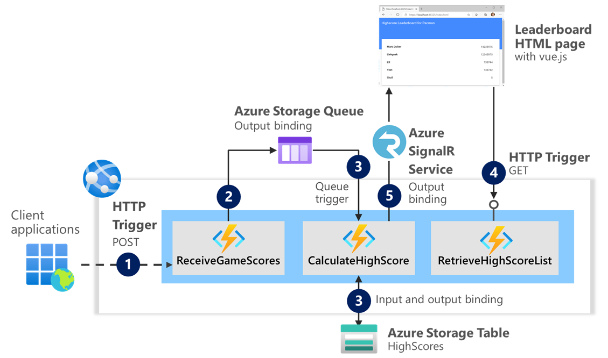

# High score application: Putting it all together

## Goal 🎯

The goal of this lesson is to create a solution that combines multiple functions to build a scalable event-driven application. You will need to build most parts yourself based on the requirements and instructions given.

> 📝 __Tip__ - If you're stuck at any point you can have a look at the [source code](../src/assignment) in this repository.

This lesson consists of the following exercises:

|Nr|Exercise
|-|-
|1|[Receiving game scores over HTTP](#1-receiving-game-scores-over-http)
|2|[Publish score received events to queue](#2-publish-score-received-events-to-queue)
|3|[Calculate high scores from events](#3-calculate-high-scores-from-events)
|4|[Build Web API to retrieve high score list](#4-build-web-api-to-retrieve-high-score-list)
|5|[Notify HTML client of updates](#5-notify-html-client-of-updates)

The architecture of the solution you are going to create in these exercises looks as follows:



It consists of three Azure Functions in a single Web Application.

## 1. Receiving game scores over HTTP

In this exercise, you will build the first function `ReceiveGameScoresFunction` that is triggered by a POST HTTP request containing a JSON payload.

### Steps

1. Create a new Visual Studio 2019 or Visual Studio Code solution `AzureFunctionsWorkshop` with an Azure Functions project `RetroGamingFunctionApp`.
2. Add a function `ReceiveGameScoresFunction` with an async `Run` method to the project. The function should be triggered by a POST request with a JSON payload containing an array of game scores:

    ```json
    [
        {
        "Nickname" : "John Doe",
        "Points" : 42,
        "Game" : "Pacman"
        },
        {
        "Nickname" : "Jane Doe",
        "Points" : 1337,
        "Game" : "Pacman"
        }
    ]
    ```

3. Create a class `GameScore` that represents the data from the HTTP request and place it in a new folder `Models`.

    ```C#
    public class GameScore
    {
        public int Points { get; set; }
        public string Game { get; set; }
        public string Nickname { get; set; }
    }
    ```

4. Deserialize the body of the HTTP request to `IEnumerable<GameScore>` objects using the `JsonConvert.DeserializeObject` method.
5. Return an `OkObjectResult` object from the function.
6. Build, run and test your function using the [assignment.http](../tst/assignment.http) file from the `tst` folder in the root of the repository.

## 2. Publish score received events to queue

Next, you will expand the function `ReceiveGameScoresFunction` to send messages for each of the received game scores to a storage queue as a way to broadcast an event. By splitting the receiving of game scores from the calculation of high scores, the scalability of the solution will improve. 

### Steps

1. Start by including a reference to the NuGet package `Microsoft.Azure.WebJobs.Extensions.Storage`, as you are going to use storage queues and tables.
2. Create a class to hold the event data that is going to be put in the message for the queue. Place this in the `Models` folder as well.

    ```c#
    public class GameScoreReceivedEvent
    {
        public Guid Id { get; set; }
        public GameScore Score { get; set; }
    }
    ```

3. Change the signature of the function `ReceiveGameScoresFunction` to include an output binding to a storage queue named `gamescorequeue`.

    > 📝 __Tip__ - Since there is more than one  message to put on the queue, use the `ICollector<GameScoreReceivedEvent>` type for the output binding.
    > 📝 __Tip__ - Make sure to create the queue in the Azure Storage Explorer before running the function.

4. Add code to your function implementation right after deserializing the array of game scores. Iterate over the received `GameScore` objects and add a new `GameScoreReceivedEvent` object to the collector. The object should contain a newly generated GUID and the current `GameScore` object.
5. Build, run (`func host start`) and test your application again. Use the Azure Storage Explorer to check that indeed two messages where placed in the queue `gamescorequeue`.

## 3. Calculate high scores from events

Every message on the `gamescorequeue` indicates a new game score that might potentially be a new high score for a certain game. In this exercise you will create a new Azure Function to trigger on new messages in the queue and calculate the new high score for the player of that game. 

The high scores are stored in a storage table `HighScores`. When a message arrives, the table is queried for a previous score by the player. If the received score is better than the one stored, you will update the table entry to reflect the higher score. Should there be no previous score in the table, a new high score entry is inserted.

### Steps

1. Create a new Azure Function `CalculateHighScoreFunction` that is triggered by a message in the `gamescorequeue`. The message will contain the `GameScoreReceivedEvent` object used in the previous exercise. Also, the method signature for `Run` should perform input and output binding to a `TableClient` to read from and write to the storage table `HighScores`.

    > 📝 __Tip__ - Make sure to import the proper namespace for the `TableClient` type. It should be `Azure.Data.Tables` for the latest Azure Storage SDK.

2. Create a class to represent a high score:

    ```c#
    public class HighScoreEntry : ITableEntity
    {
        public int Points { get; set; }

        public string PartitionKey { get; set; }
    
        public string RowKey { get; set; }
        
        public DateTimeOffset? Timestamp { get; set; }
    
        public ETag ETag { get; set; }
    }
    ```

    > 🔎 **Observation** - As you can see there is only one property needed, the Points. The `PartitionKey` is used for the game name and the `RowKey` is for the player nickname. The `Timestamp` and `ETag` properties are used by the storage table to keep track of changes.

3. Implement the function to query the table for an existing high score entry.
Here are some useful fragments to help you out.

    ```C#
try
{
    var result = await table.GetEntityAsync<HighScoreEntry>(message.Score.Game.ToLower(), message.Score.Nickname);
    entry = result.Value;
}
catch (RequestFailedException e) // item does not exist
{
    entry = new HighScoreEntry
    { 
        PartitionKey = message.Score.Game.ToLower(),
        RowKey = message.Score.Nickname 
    };
}  
    ```

4. Check whether the retrieved result contains a `HighScoreEntry` instance by validating that you did not get a 404 result. If there was no previous score stored, create a new object `HighScoreEntry` with the `PartitionKey` and `RowKey` set to the game name and player's nickname from the event and a zero `Points` score.

5. When the score from the received event is better than a previously registered score, or it is the first score for that player, we have a new high score. Update the `Points` for the `HighScoreEntry` and store it in the table `HighScores`. The following code fragment stores an entry in a storage table:

    ```C#
    entry.ETag = ETag.All;
    entry.Points = message.Score.Points;

    var store = await table.UpsertEntityAsync(entry);
    ```

6. Build and run your solution and test your new function. Verify that the entries are stored in the storage table using the Azure Storage Explorer. Change the points in the game scores to see the effect in behavior of the function.

## 4. Build Web API to retrieve high score list

In this exercise you will create a REST Web API by building a third Azure Function that is triggered by an HTTP GET request. Also, you are going to consume this REST API with a client HTML application that is included in the sources of the assignment exercise.

### Steps

1. Add a new Azure Function `RetrieveHighScoreListFunction` to your project. It should trigger on HTTP GET requests for a route with path `highscore/{game}`. The placeholder `{game}` represents the name of the game. It is used to retrieve the correct high score list.

    > 📝 __Tip__ - Remember that for HTTP triggers you can include the names of placeholders in routes as arguments to your `Run` method, so you can easily use the value.

2. Check the query string value for `top` of the HTTP request that triggered your function. It is optional and, if present, contains the number of entries that should be returned for the high score list. It should not exceed 20 and be 10 by default.
3. Add an input binding argument `table` for the storage table to the signature of the `Run` method. Query the `HighScores` table using this `TableClient` reference.

    ```C#
    Pageable<HighScoreEntry> queryResults = table.Query<HighScoreEntry>(x=>x.PartitionKey == game, top );   
    ```

4. Return an `OkObjectResult` that holds a projected array of anonymous typed objects for the nickname and points for each player in the high score list. The anonymous type should be like this:

    ```C#
    return new OkObjectResult(queryResults.Take(top).Select(e => new
            {
                Nickname = e.RowKey,
                Points = e.Points
            }));
    ```

5. Build, run (`func host start`) and test your new Azure Function. Make an HTTP GET request to `http://localhost:7071/api/highscore/pacman` or any of the other game names you might have used. Fix any errors if needed.
6. Copy the entire project `RetroGamingWebsite` from the [source code](../src/assignment/RetroGamingWebsite) to the root of your solution. Inspect the `wwwroot` folder and the `index.html` file in particular. It is a single HTML file that uses Vue.js to build a user interface with the high score list. Find the JavaScript code that calls the Web API you build in the previous steps of this exercise.
7. Start both the Azure Function project and the new Web API project. In Visual Studio you can do this using multiple startup projects. Navigate to the `/index.html` page to verify a working website consuming your Web API.
If it is not working, CORS settings of your HTTP trigger function might be the culprit. Change the `local.settings.json` file to include a new root level section for `Host`, like so:

    ```json
      "Host": {
        "LocalHttpPort": 7071,
        "CORS": "*"
      }
    ```

## 5. Notify HTML client of updates

> __Note__: This final exercise is optional. It requires an Azure subscription to use Azure SignalR Service.

This exercise uses Azure SignalR Service to push updates of the highscore list to the active browser clients running the HTML website from the previous exercise. Whenever a new highscore is detected during the calculation, a message is pushed to a SignalR hub. You are going to use Azure SignalR Service to host the hub.

### Steps

1. Include a reference to the NuGet package `Microsoft.Azure.WebJobs.Extensions.SignalRService` to your Azure Functions project.
2. Revisit the `CalculateHighScoreFunction` and add an output binding for a SignalR hub named `leaderboardhub`.

    ```C#
    [SignalR(HubName = "leaderboardhub")] IAsyncCollector<SignalRMessage> signalRMessages
    ```

2. Right after a new high score is stored, also add a `SignalRMessage` object to the async collector. Since the JavaScript in the HTML page already assumes some values for the target in the hub, this fragment might be of use:

    ```c#
    await signalRMessages.AddAsync(new SignalRMessage()
    {
        Target = "leaderboardUpdated",
        Arguments = new string[] { }, 
    });
    await signalRMessages.FlushAsync();
    ```

3. Create a new Azure SignalR Service in your Azure subscription. Retrieve the connection string from the Azure Portal and include it in the `local.settings.json` file in the root of your solution under `Values` for a new `AzureSignalRConnectionString` key.

    ```json
    {
      ...
      "Values": {
        ...
        "AzureSignalRConnectionString": "your-connection-string",
      }, ...
    }
    ```

4. Build, run and test your entire solution again. Post a new high score for the game `Pacman` and watch any changes in the high score list appear. Again, fix any errors.

    > 📝 __Tip__ - Remember you can always compare your implementation with the complete lab files for the assignment in the repository.

### Additional ideas
If you have an Azure subscription you may want to explore some more. Here are some ideas for additional tasks in this solution:
- Use an Azure storage table and queue instead of using the storage emulator. This will require you to create the resources in Azure, find the connection strings. Change the `local.settings.json file` and replace `UseDevelopmentStorage=true` with the actual connection string to the Azure resource.
- Change the implementation for `ReceiveGameScoresFunction` and `CalculateHighScoreFunction` to use a Cosmos DB resource in Azure or using the [Azure Cosmos DB emulator](https://docs.microsoft.com/en-us/azure/cosmos-db/local-emulator?tabs=cli%2Cssl-netstd21)

## Summary
You have created an entire application using multiple Azure Functions. With this scalable, event-driven as a basis you can start to discover more of the use of Azure Functions in your implementations. 

---
[◀ back to README](../README.md)