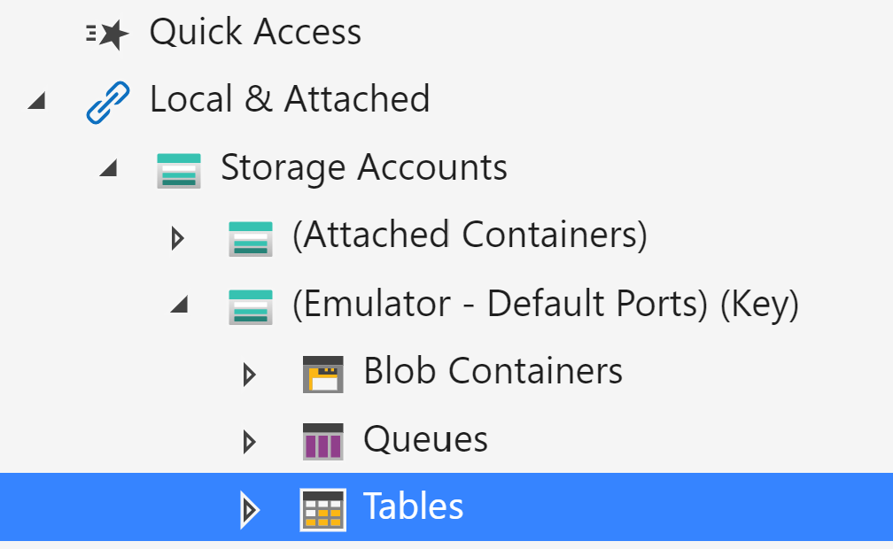
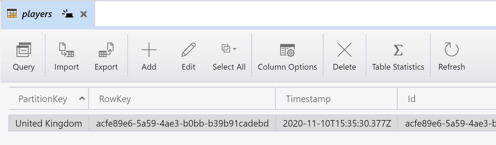

# Table Bindings

## Goal 🎯

The goal of this lesson is to learn how to table input and output bindings work.

This lesson consists of the following exercises:

|Nr|Exercise
|-|-
|1|[Using the Microsoft Azure Storage Explorer for Tables](#1-using-the-microsoft-azure-storage-explorer-for-tables)
|2|[Using a return attribute Table output binding](#2-using-a-return-attribute-table-output-binding)
|3|[Using an `IAsyncCollector<T>` Table output binding](#3-using-an-iasynccollectort-table-output-binding)
|4|[Using a `TableEntity` Table input binding](#4-using-a-tableentity-table-input-binding)
|5|[Using a `CloudTable` Table input binding](#5-using-a-cloudtable-table-input-binding)
|6|[More info](#6-more-info)

> 📝 **Tip** - If you're stuck at any point you can have a look at the [source code](../src/table) in this repository.

---

## 1. Using the Microsoft Azure Storage Explorer for Tables

In this exercise we'll look into storage emulation and the Azure Storage Explorer to see how you can interact with queues and messages.

### Steps

1. Make sure that the storage emulator is running and open the Azure Storage Explorer.
2. Navigate to `Storage Accounts` -> `(Emulator - Default Ports)(Key)` -> `Tables`
   
3. Right click on `Table` and select `Create Table`
4. Type a name for the table: `players`
5. Select the new table.
    
    > 🔎 **Observation** - Now you see the contents of the table. In your case it is still empty. In the top menu you see actions you can perform on the table or its entities.
6. Try adding a record to the table.
    > ❔ **Question** - What are the two mandatory fields to provide values for?

    > 📝 **Tip** - The `PartitionKey` is used to determine in which partition the entity is stored, and is crucial for scalability and effective querying of the entities. The `RowKey` is a unique identifier of tht entity within the partition. The combination of the `PartitionKey` and the `RowKey` is the primary key of the entity. More info about partition and row keys can be found in the [official docs](https://docs.microsoft.com/en-us/rest/api/storageservices/designing-a-scalable-partitioning-strategy-for-azure-table-storage).

## 2. Using a return attribute Table output binding

In this exercise we'll be using a `return Table` attribute as the output binding, to store a `PlayerEntity` in the `players` table.

### Steps

1. In VSCode, create a new HTTP Trigger Function App with the following settings:
   1. Location: *AzureFunctions.Table*
   2. Language: *C#*
   3. Template: *HttpTrigger*
   4. Function name: *StorePlayerReturnAttributeTableOutput*
   5. Namespace: *AzureFunctions.Demo*  
   6. AccessRights: *Function*
2. Once the Function App is generated, add a reference to the `Microsoft.Azure.WebJobs.Extensions.Storage` NuGet package to the project. This allows us to use bindings for Blobs, Tables and Queues.

   > 📝 **Tip** - One way to easily do this is to use the _NuGet Package Manager_ VSCode extension:
   > 1. Run `NuGet Package Manager: Add new Package` in the Command Palette (CTRL+SHIFT+P).
   > 2. Type: `Microsoft.Azure.WebJobs.Extensions.Storage`
   > 3. Select the most recent (non-preview) version of the package.

3. We'll be working with a `PlayerEntity` type in the exercises. Add a new class file to the project named `PlayerEntity.cs` and copy the contents from [this file](../src/table/Models/PlayerEntity.cs) in it.

   > 📝 __Tip__ The `PlayerEntity` object inherits from `TableEntity`. Make sure you reference the `TableEntity` type from the `Microsoft.Azure.Cosmos.Table` namespace and **not** the `Microsoft.WindowsAzure.Storage.Table` since the last one is outdated.

   > 🔎 __Observation__ The `TableEntity` type contains all the mandatory properties an entity has, such as the `PartitionKey`, `RowKey`, and `TimeStamp`. Inheriting from this type is not mandatory, as long as your custom type has the two Key properties, but it makes it easier to work with Table Storage.

4. To make it easier to refer to the table name (`players`) we can put it in a constant in a new class.
   1. Add a new file to project called `TableConfig.cs`
   2. Add the following code to this class:

      ```csharp
      namespace AzureFunctions.Table
      {
         public static class TableConfig
         {
            public const string Table = "players";
         }
      }
      ```

5. Now let's go back to the function and put the following line underneath the `FunctionName` attribute:

   ```csharp
   [return: Table(TableConfig.Table)]
   ```

6. Update the `HttpTrigger` attribute so it only accepts `POST` requests.
7. Since we'll be returning a `PlayerEntity` instead of an `IActionResult`, update the method return type to:

   ```csharp
   public static async Task<PlayerEntity> Run(...)
   ```

8. Replace the entire contents of the function method with these lines:

   ```csharp
    var playerEntity = await message.Content.ReadAsAsync<PlayerEntity>();
   playerEntity.SetKeys();

   return playerEntity;
   ```

   > ❔ __Question__ - Notice the use of the `SetKeys()` method. What is the purpose of this method?

9. Make sure the storage emulator is running, then build & run the `AzureFunctions.Table` Function App.

   > ❔ __Question__ - Have a look at the runtime output. Did the Function App startup successfully?

10. Make a POST call to the `StorePlayerReturnAttributeTableOutput` endpoint and provide a valid json body with a `PlayerEntity` object (the `PartitionKey` and `RowKey` are not required):

      ```http
      POST http://localhost:7071/api/StorePlayerReturnAttributeTableOutput
      Content-Type: application/json

      {
         "id": "{{$guid}}",
         "nickName" : "Ada",
         "email" : "ada@lovelace.org",
         "region" : "United Kingdom"
      }
      ```

   > ❔ __Question__ - Have a look at the runtime output. Did the function execute successfully?

   > ❔ __Question__ - Now use the Storage Explorer and look at the `players` table. Is there a new record? If so, open it to inspect it.

## 3. Using an `IAsyncCollector<T>` Table output binding

In this exercise we'll be using a `IAsyncCollector<PlayerEntity>` table output binding to store multiple `PlayerEntity` objects in the `players` table.

### Steps

1. Create a copy of the `StorePlayerReturnAttributeTableOutput.cs` file and rename the file, the class and the function to `StorePlayersWithCollectorTableOutput.cs`.
2. We won't use a return attribute this time, so remove the line with `[return: Table(TableConfig.Table)]`.
3. Change the return type of the method to `Task<IActionResult>`.
4. Since we expect an HTTP request with an array of `PlayerEntity` elements, update the `HttpTrigger` input type from:

   ```csharp
   Player player
   ```

   to

   ```csharp
   PlayerEntity[] playerEntities
   ```

5. Now add the following table binding underneath the `HTTPTrigger`:

   ```csharp
   [Table(TableConfig.Table)] IAsyncCollector<PlayerEntity> collector
   ```

6. Replace the content of the function with this:

   ```csharp
   foreach (var playerEntity in playerEntities)
   {
       playerEntity.SetKeys();
       await collector.AddAsync(playerEntity);
   }

   return new AcceptedResult();
   ```

   > 🔎 __Observation__ We're iterating over the player items in the playerEntities array. The PartitionKey and RowKeys are set for each item, then the item is added to the collector. The items are only stored to the table when the function completes or when `FlushAsync()` on the collector is called explicitly.

7. Make sure the storage emulator is running, then build & run the `AzureFunctions.Table` Function App.

8. Make a POST call to the `StorePlayersWithCollectorTableOutput`
 endpoint and provide a valid json body with multiple `PlayerEntity` objects:

      ```http
      POST http://localhost:7071/api/StorePlayersWithCollectorTableOutput
      Content-Type: application/json

      [
         {
            "id": "{{$guid}}",
            "nickName" : "Grace",
            "email" : "grace@hopper.org",
            "region" : "United States of America"
         },
         {
            "id": "{{$guid}}",
            "nickName" : "Ada",
            "email" : "ada@lovelace.org",
            "region" : "United Kingdom"
         },
         {
            "id": "{{$guid}}",
            "nickName" : "Margaret",
            "email" : "margaret@hamilton.org",
            "region" : "United States of America"
         }
      ]
      ```

   > ❔ __Question__ - Now use the Storage Explorer and look at the 
`players` table. Is there a new record? If so, open it to inspect it.

## 4. Using a `TableEntity` Table input binding

In this exercise we'll be using a `TableEntity` type as the table input binding where we specify both the `PartitionKey` and the `RowKey` to retrieve one `PlayerEntity` from the `players` table and return it in the HTTP response.

### Steps

1. Create a copy of the `StorePlayersWithCollectorTableOutput.cs` file and rename the file, the class and the function to `GetPlayerByRegionAndIdPlayerEntityInput.cs`.
2. Change the return type from async `Task<IActionResult>` to `IActionResult` since the method will not be asynchronous.
3. Update the `HttpTrigger` as follows:

   ```csharp
   [HttpTrigger(
      AuthorizationLevel.Function,
      nameof(HttpMethods.Get),
      Route = "players/{region}/{id}")] HttpRequest request,
   ```

   > 🔎 __Observation__ Notice that we only accept GET requests. In addition, a custom route is now specified which contains a region and id. These correspond to the PartitionKey and RowKey of the entity we will retrieve.

4. We can't use the `region` and `id` from the route unless we add these as separate parameters to the method:

   ```csharp
   string region,
   string id,
   ```

5. Now update the `Table` binding to:

   ```csharp
   [Table(
      TableConfig.Table,
      "{region}",
      "{id}")] PlayerEntity playerEntity
   ```

   > 🔎 __Observation__ In this table input binding three parameters are used: the table name, the PartitionKey, and the RowKey. This binding allows us to retrieve exactly one entity from the table.

6. Replace the contents of the function method with this single line:

   ```csharp
   return new OkObjectResult(playerEntity);
   ```

7. Make sure the storage emulator is running, then build & run the `AzureFunctions.Table` Function App.

8. Ensure that there is at least one `PlayerEntity` in the `players` table and make note of the `PartitionKey` and `RowKey` of this record.

9. Make a GET call to the `StorePlayersWithCollectorTableOutput`

   ```http
   @region = United States of America 
   @id = 2c847c33-1c54-4c21-aa1a-a5c0a40f755a
   GET http://localhost:7071/api/players/{{region}}/{{id}}
   ```

   > 🔎 __Observation__  The `region` and `id` fields need to match with an entity in your `players` table.

   > ❔ __Question__ - Did the function return with a 200 OK, including the player data?

## 5. Using a `TableClient` Table input binding

In this exercise we'll be using a `TableClient` type as the table input binding, and use a `TableQuery` to retrieve multiple `PlayerEntity` objects from the `players`table and return it in the HTTP response.

### Steps

1. Create a copy of the `GetPlayerByRegionAndIdPlayerEntityInput.cs` file and rename the file, the class and the function to `GetPlayersByRegionCloudTableInput.cs`.
2. We won't be using route parameters so remove the `/{region}/{id}` part of the Route:

   ```csharp
   [HttpTrigger(
      AuthorizationLevel.Function,
      nameof(HttpMethods.Get),
      Route = "players")] HttpRequest request
   ```

3. Remove the `region` and `id` parameters from the method parameters.
4. Update the table input binding to it only uses the table name:

   ```csharp
   [Table(TableConfig.Table)] TableClient cloudTable
   ```

   > 🔎 __Observation__ Note that we're using the TableClient type, ensure that this type comes from the `Microsoft.Azure.Cosmos.Table` namespace. This type refers to a Table in either a Storage Account, or in CosmosDB.

5. Replace the contents of the functions method with this:

   ```csharp
   string region = request.Query["region"];
   var regionFilter = new TableQuery<PlayerEntity>()
       .Where(
           TableQuery.GenerateFilterCondition(
               "PartitionKey",
               QueryComparisons.Equal,
               region));
   var playerEntities = cloudTable.ExecuteQuery<PlayerEntity>(regionFilter);

   return new OkObjectResult(playerEntities);
   ```

   > 🔎 __Observation__ The region is extracted from the query string. The region is also the `PartitionKey` and will be used to query the `PlayerEntity` objects within the region.

   > 🔎 __Observation__ The query (or filter) is made via a special `TableQuery<T>` type and contains a where clause which specifies the condition records should match. The query is then passed to the `ExecuteQuery<T>()` method of the `CloudTable` and results in a collection of `PlayerEntity` objects.

   > 📝 __Tip__ - Look into the [TableQuery object definition](https://docs.microsoft.com/en-us/dotnet/api/microsoft.azure.cosmos.table.tablequery?view=azure-dotnet) and check what kind of methods it supports.

6. Make sure the storage emulator is running, then build & run the `AzureFunctions.Table` Function App.

7. Ensure that there are a couple of `PlayerEntity` objects in the `players` table and decide which `PartitionKey` you'll use for querying.

8. Make a GET call to the `GetPlayersByRegionCloudTableInput`

   ```http
   @region = United States of America
   GET http://localhost:7071/api/players?region={{region}}
   ```

   > 🔎 __Observation__  The `region` field needs to match with an entity in your `players` table.

   > ❔ __Question__ - Did the function return with a 200 OK, including the player data?

## 6. More info

For more info about the Table Bindings have a look at the official [Azure Functions Table Binding docs](https://docs.microsoft.com/en-us/azure/azure-functions/functions-bindings-storage-table-output?tabs=csharp).

---
[◀ back to README](../README.md)
