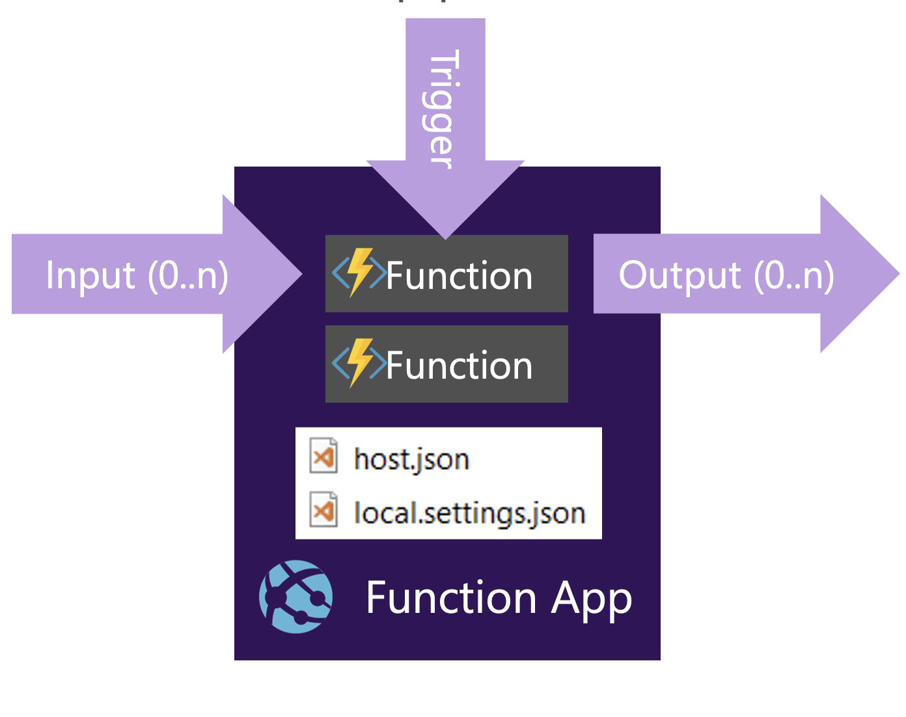
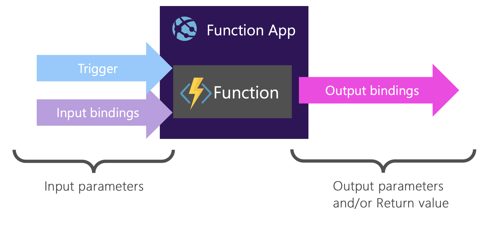

# <!--fit--> Workshop: Serverless .NET Core Solutions using Azure Functions


---

## Hands-on labs for Azure Functions

 * Lab 1 - Azure Functions 101​
 * Lab 2 – Build an end-to-end solution​
 * Lab 3 – Unit testing your functions ​
 * Lab 4 – Deploying to Azure

---
## Showcasing the following features:

 * HTTP Triggers​
 * Queues​
 * SignalR Service​
 * Table storage
 * Azure
 * AZ CLI
---

<!-- class: lead  -->
## Transitioning to server-less


### There are no servers…​ When you do not need them

___
<!-- class: lead invert -->

## Functions as a Service (FaaS)​

### Small pieces of self-contained server-side logic​

- **Event-driven**​  Responds to external triggers​
- **Instant scaling** ​ Abstraction of server infrastructure​, Scales when needed
- **Pay by consumption**​ Charged by GB-s and # of executions​

---


## Anatonomy of an Azure Function App

- Hosted as Azure App Service​
- JSON based configuration​
- Running (multiple) functions​

Trigger starts execution​

Bindings for ​input and output​


___
## Programming model: It’s a function​



---
## Triggers provide metadata


```csharp
[FunctionName("ValidateBlobSize")]
public static void Run(
  [QueueTrigger("ImagesInput",  Connection = "…")] string blobNameInMessage,
  int dequeueCount,
  [Blob("images/{queueTrigger}", FileAccess.Read, 
  Connection = "…")] Stream blob,
  TraceWriter log) { // Your function code …
}
```
---

Browse to: https://github.com/XpiritBV/AzureFunctionsWorkshop​
​
```bash
git clone https://github.com/XpiritBV/AzureFunctionsWorkshop.git
```

or use CodeSpaces  

---