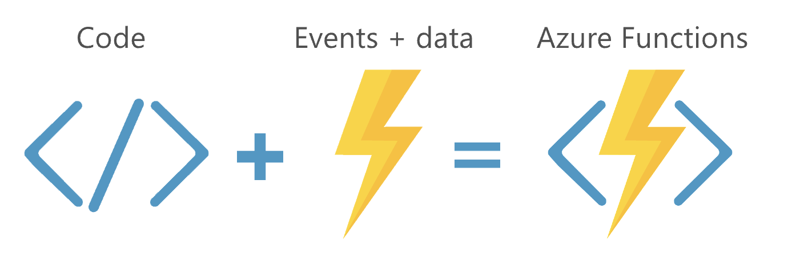

# <!--fit--> Workshop: Serverless .NET Core Solutions using Azure Functions


---

## Hands-on labs for Azure Functions

 * Prequisites and setup
 * Lab 2..4  - Azure Functions 101​
 * **Lab 5 – Build an end-to-end solution​**
 * Lab 6 – Unit testing your functions ​
 * **Lab 7 – Deploying to Azure**

---
## Showcasing the following features:

 * HTTP Triggers​
 * Queues​
 * Table storage
 * Run in Azure 
 * AZ CLI / Func CLI
 * Unit Testing
 * (SignalR Service​)
---

<!-- class: lead  -->
## Transitioning to server-less


### There are no servers…​ When you do not need them

___
<!-- class: lead invert -->

## Functions as a Service (FaaS)​

### Small pieces of self-contained server-side logic​

- **Event-driven**​  Responds to external triggers​
- **Instant scaling** ​ Abstraction of server infrastructure​, scales when needed
- **Pay by consumption**​ Charged by GB-s and # of executions​

---
# Server-less platform providers

## Major cloud provider offer FaaS

- Amazon Lambda​ (2014)
- Google Cloud Functions (2016)
- Azure Functions (2016)
- Auth0 Webtasks​ (2016)
---
# Focusing on Azure Functions


## Process events with server-less code


---
# About Azure Functions

- Open source: https://github.com/Azure/Azure-Functions 
- Many available languages:
  - C#, JavaScript, F#, Java, PowerShell, Python, PHP, Batch, Bash
- Built on top of Azure WebJobs SDK
- Support for multiple runtimes: 
  - .NET Framework and .NET Core 1.0+, NodeJS, Python, PowerShell

---


## Anatonomy of an Azure Function App

- Hosted as Azure App Service​
- JSON based configuration​
- Running (multiple) functions​

Trigger starts execution​

Bindings for ​input and output​

___
## Programming model: It’s a function​


---
## Triggers provide metadata

```csharp
[FunctionName("ValidateBlobSize")]
public static void Run(
  [QueueTrigger("ImagesInput",  Connection = "…")] string blobNameInMessage,
  int dequeueCount,
  [Blob("images/{queueTrigger}", FileAccess.Read, 
  Connection = "…")] Stream blob,
  TraceWriter log) { 
    // Your function code …
}
```
---

Browse to: https://github.com/XpiritBV/AzureFunctionsWorkshop​

```bash
git clone https://github.com/XpiritBV/AzureFunctionsWorkshop.git
```

or use CodeSpaces for a full remote development experience

---